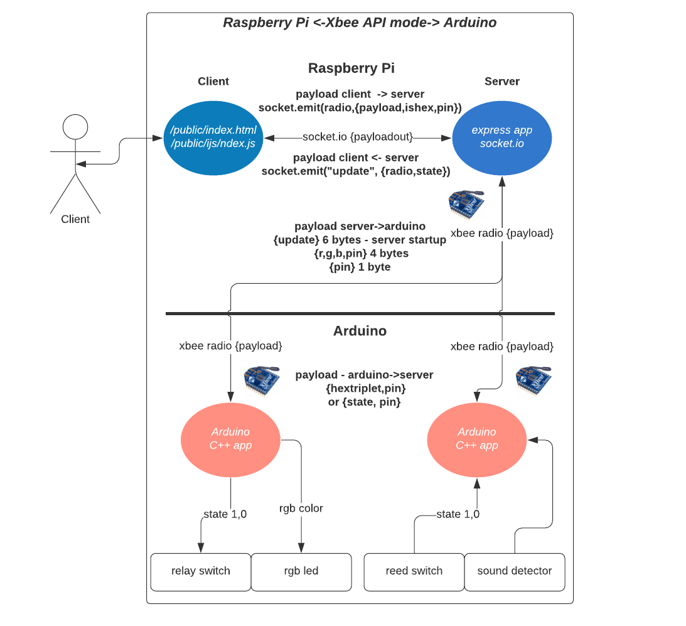
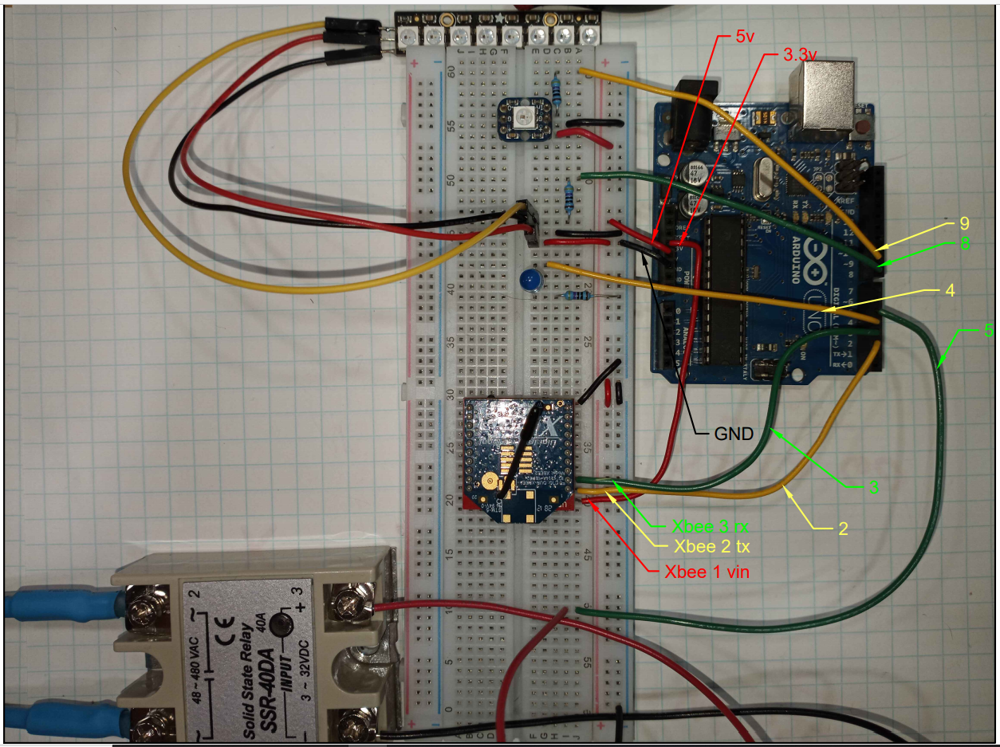

## **IoT Server: Raspberry Pi <-Xbee-> Arduino**

---

---

### Raspberry Pi code link below
https://github.com/prichardsondev/RaspberryPiServer_Xbee_Pi  

### Description
Communication between Raspberry Pi and Arduino using Xbee Radios  

Code by no-means is perfect - I welcome any input

Note: Arduino code set up to be non-blocking using timers - there are libraries that may do  
this better. Many great tutorials using timers in arduino - adafruit has one of them

---

### Video Overview
https://www.youtube.com/watch?v=zoc-5arh9Yg&list=PLlnL61QfD9UbcGw8Oxz-KtOhbSqJ4oTW1

---

### Hardware:
- Raspberry Pi 3 or 4
- Arduino Uno/Mega/other
- 2 Xbee radios S2 or S3
- Xbee USB explorer / Xbee breadboard explorer
- Breadboads/Wires/LEDs
- RGB LEDs - I'm using WS2812B
  
---

#### To run:

- Add Platformio extension to VSCode
  - Or use Arudino editor if you choose

- Add Xbee library to project by Andrew Rapp

- Connect xbee to arduino
  - See notes for #define DEBUG ... top of src/main.cpp
  - Connect using an xbee breadboard explorer and jumper wires or xbee shield
    - sparkfun/adafruit/...
- Connect something to toggle.
  - If you have a WS2812 (neopixel if you buy from adafruit) connect to pin  
      8 or 9 or both if you have 2...
  - If you have something to toggle (breadboard led, relay switch, ...) connect  
      to pin 4 or 5.
  - Note the pins you chose /RaspberryPiServer_Xbee_Pi/public/index.html should match
- Open /src/main.cpp
  - Note the statements
    -  NeopixelHelper strip(8, 7, 500);
       - A WS2812 is connected to pin 8, strip of 7 with delay of .5 seconds between setting color
    - PinHelper testPin4(4);
      - Something to toggle is connected to pin 4 (Breadborad led, relay switch, ...)
- Open /lib/xbeeHelper.cpp
  - See notes - modify to address of your Coordinator Radio attached to Raspberry Pi
- Load the file - figure out what went wrong -)

  

